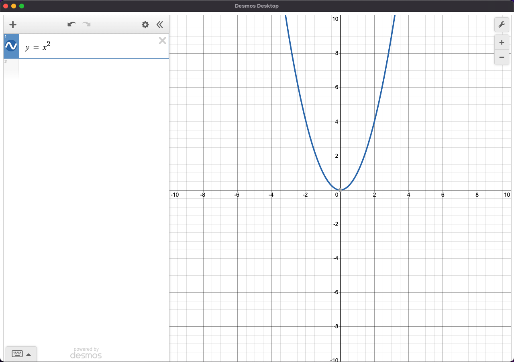
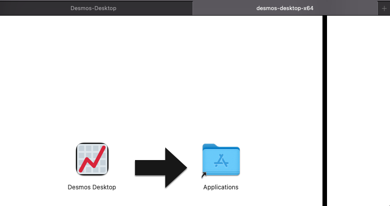

# Desmos Desktop

 



⚠️ **This is not an official desktop app for Desmos.**

This is a basic desktop app that wraps around the official remote hosted [Desmos API](https://www.desmos.com/api/v1.7/docs).

You will need internet access since the API is not installed locally.

# Install

Go to releases and install the latest version for your architecture (x64 or arm64).

# Install(Manual)

Clone the repository 

```bash 
git clone <SSH/HTTPS>
```

Install npm dependencies 

```bash
npm install 
```

Package the app (x64)

```bash
make package 
#or 
npm run package
```

Package the app (arm64)

```bash
make package-arm
#or 
npm run package-arm
```

Open the `.dmg` and drag the `.app` to the Applications folder.



# Development

Clone the repository 

```bash 
git clone <SSH/HTTPS>
```

Install npm dependencies 

```bash
npm install 
```

Run Electron on root

```bash
make electron
#or
npm run electron
```

Package the app for production (x64)

```bash
make package
#or
npm run package
```

Package the app for production (arm64)

```bash
make package-arm
#or 
npm run package-arm
```

